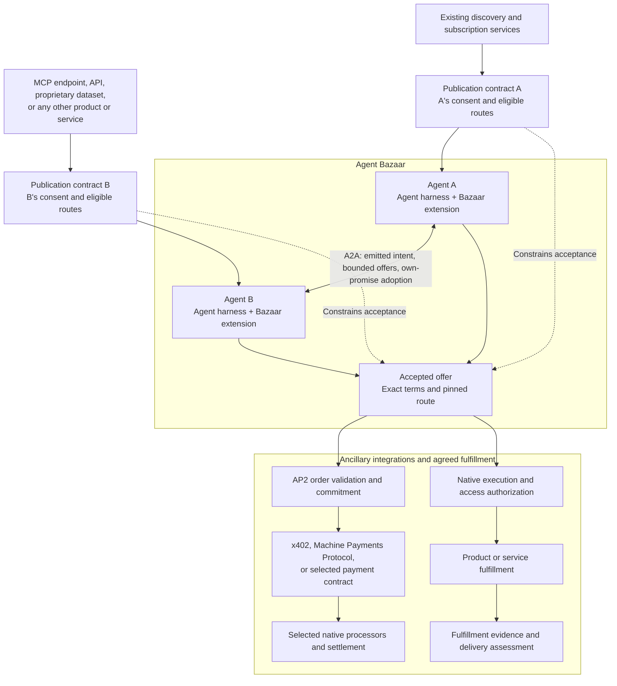

# Agent Bazaar: contracts between autonomous agents

> **Historical draft — superseded by [0.2](../../README.md).** This directory preserves the earlier design, including requirements that were subsequently removed or changed. Use the current root contract and schemas for new work.

**Standards proposal 0.1 · October 8, 2026**

**License: [MIT](LICENSE).** Bazaar's original specification, schemas and examples are MIT licensed. Its implementation will be independently authored under MIT as well. Comparison frameworks provide inspiration and review material; their code, schemas and test suites are not implementation inputs. Linked third-party materials retain their own licenses.

An agent should be able to ask for an outcome, compare offers from agents it was not built to use, agree on a product or service, authorize the exchange, and assess fulfillment. The agreement and its evidence should remain interpretable when the parties use different runtimes or marketplaces.

**Agent Bazaar is an A2A extension for intent, promises, and bounded negotiation.** Either party can publish what it seeks without making a service offer. Anyone may describe a proposed exchange; only the identified promiser's authenticated adoption can issue its promise. The extension preserves those distinctions through iterative offers, agreement, task execution, and outcome assessment.

Existing discovery and subscription services apply the publication contract's high-level consent and eligible commercial routes alongside their own sales business rules. A2A mediates communication between the agents. Agent B may offer an MCP endpoint or any other product or service covered by the agreement.

The paid flow is **accepted offer → AP2 order validation and commitment → x402 or Machine Payments Protocol (MPP) → selected native processors and settlement**. Eligible complete routes are declared during publication and discovery; both parties pin one in accepted terms. Existing frameworks retain their responsibilities, and Agent Bazaar binds their native records to the promises and agreement they serve.

## Read this first

[Required contract map](contract-map.md) translates the agreed diagram into eight contracts, their owners, required behavior and current specification coverage.

1. [Protocol architecture and diagrams](protocol-architecture.md): the A2A extension, framework boundaries, and end-to-end interactions.
2. [Product spec](product-spec.md): the problem, participants, scope, research demo, and success criteria.
3. [Protocol contract](contract.md): what messages mean, who can change state, authority boundaries, and failure handling.
4. [Publication and discovery contract](publication-contract.md): high-level consent, sales-rule references, eligible complete routes, and withdrawal semantics.
5. [Conformance plan](conformance.md): required interoperability and adverse-case behavior.
6. [Sources and decisions](sources-and-decisions.md): technical foundations and decisions.
7. [Machine-readable contract schemas](schemas/contract.schema.json) and [example research terms](examples/research-terms.json): structural definitions for review.
8. [Reference negotiation profile](reference-negotiation-profile.md): one concrete reception-permit and budget implementation; discovery and admission services can use their own conforming mechanisms.

[Recursive overlap and product-thesis audit](novel-angle-audit.md) compares the current design with the prior-chat projects, their linked protocols and newly identified close neighbors.

[Related-work licensing and independent implementation](reuse-and-licensing.md) preserves the comparison research and records the user's direction: inspiration only, with original MIT-licensed Bazaar work.

## The central distinction

| Object | What it establishes |
|---|---|
| Intent | What its emitter seeks: an outcome, work, a customer, or a collaboration; no reciprocal obligation |
| Publication contract | High-level publication/contact consent, referenced business rules, and eligible complete commercial routes |
| Offer | Proposed promises about the offerer's own behavior, plus requests for reciprocal promises |
| Offering | The product, service, or MCP endpoint access being proposed, its fulfillment mode, and its immutable specification |
| Performance terms | The selected profile's fulfillment and assessment terms; offers reference their exact content and the agreement includes it |
| Negotiation channel | A consented exchange with bounded iterative offers under a selected admission policy |
| Promise issued | An agent's adopted statement about its own behavior; it may precede or exist outside an agreement |
| Accepted offer / agreement | Reciprocal commitments to the same frozen terms and commercial route; the research profile uses award, adoption, and finalization |
| AP2 order validation / commitment | Validation of the accepted order and relevant authority for its payment obligation |
| Authorization binding | The native authority evidence covering a particular agreement, executor, and action |
| Delivery | The provider's claim that particular artifacts satisfy its promise |
| Assessment + delivery acceptance | The named evaluator's findings, followed by the buyer's decision about fulfillment |
| Settlement evidence | What a payment adapter can establish about an identified obligation |

“I want a report” does not mean “I offer to pay for a report.” “I want research work” does not mean “I promise to produce this report.” Either side may initiate an offer, but an offer cannot create the other side's promise. A declared desire does not, by itself, promise to provide, receive, or purchase the requested service.

Offers can iterate inside a bounded channel. A revision explicitly replaces that party's earlier offer; it does not create another broadcast. Unsolicited follow-ups, duplicate relays, and exhausted reply budgets cannot reopen negotiation.

Commercial offer acceptance and delivery acceptance are separate events. Payment always follows the accepted offer and required AP2 validation, but its agreed trigger can precede fulfillment. An existing AP2 mandate may precede negotiation; it must cover the accepted terms before payment proceeds. Native final records and receipts may arrive after payment. An agreement alone does not grant tool access, a completed task does not establish delivery acceptance, and delivery acceptance does not establish payment.

Additional paid-exchange profiles can compose through a compatible published commercial route. They preserve the same accepted-offer and AP2 validation gates.

## Reference demonstration

The user selected **source-backed research** as the first demonstration. A buyer requests a comparison of three agent protocols. Three fictional providers return different offers; one is selected. The winner delivers a report plus claim-to-source records. Structural checks and a named human reviewer assess the result. The demonstration includes a rejected result and expired or revoked native execution authority.

The reference demonstration uses one buyer, one selected provider, one frozen agreement, one deliverable package, and one buyer-controlled procurement slot. It compares simulated quotes and uses the reference permit/admission mechanism. Its report rubric and correction budget belong to the research performance profile; its procurement slot belongs to the selected bilateral formation profile. The core supports other products, services, and admission implementations. Payment processors and contracts retain custody, settlement, escrow, and refund behavior.

The payment branch applies to real paid exchanges; `none` and `simulated` create no real payment authority. The accepted terms specify payment timing relative to fulfillment. A lost confirmation requires reconciliation under the original operation identity. In the research profile, finalization makes the commercial acceptance deadline and one-winner decision explicit.

## Standardization and conformance

Conforming implementations must interpret the same consent and agreement, reject the same invalid transitions, and reconcile the same evidence through A2A. Core conformance permits different discovery, subscription, and admission implementations. Reference-profile cases separately exercise concrete permits and the research workflow.

Agent Bazaar standardizes emitted intent, self-owned reciprocal promises, and bounded iterative negotiation as a coherent A2A extension. Related work supplies comparison points and integration partners. The proposal stands on the precision of its semantics, the clarity of its boundaries, and interoperable implementation.

## Current status

The specification, schemas, diagrams, and synthetic examples are available for review. Structural checks are recorded in [validation](validation.md). Runtime and interoperability testing are the next implementation work.

Remaining release decisions include the published extension URI, existing signature/trust profile, and pinned native payment profiles. Buyer-coordinated finalization and human semantic assessment define the research demonstration. See the [decision register](sources-and-decisions.md).
