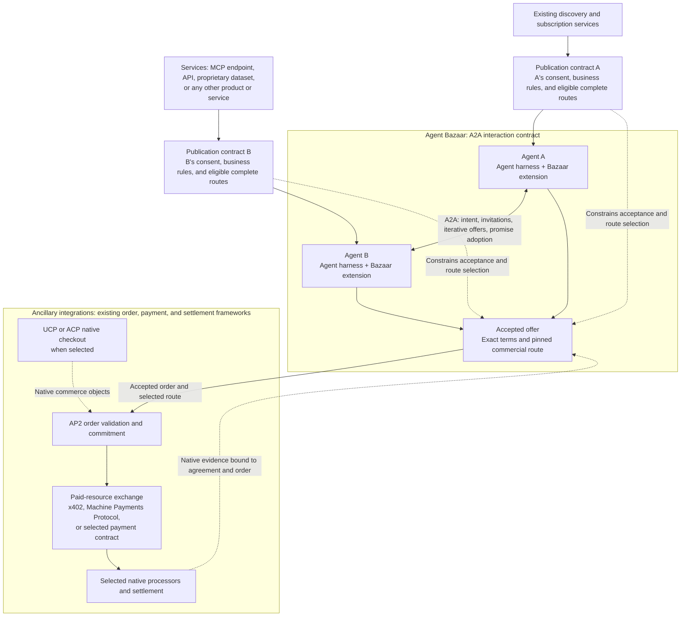

# Agent Bazaar: an A2A extension

**Standards proposal 0.1 · October 8, 2026**

**Agent Bazaar is the interaction contract between autonomous agent harnesses communicating through A2A.** Its boundary contains emitted intent, consent to negotiate, iterative offers, self-authored promises, and agreement formation. Each harness connects to independent sources through the publication contract: discovery and subscription services on one side; an MCP endpoint, API, proprietary dataset, or another product or service on the other. The two publication contracts use the same standard while expressing each agent's own consent and eligible commercial routes.

Existing frameworks connect downstream of the accepted offer. AP2 validates the order commitment; the selected paid-exchange protocol, native processors, and settlement system perform their established roles. These are ancillary integrations to the Bazaar interaction. Their native evidence remains bound to the accepted terms and the complete route selected under both publication contracts.

## Protocol composition



The agents are symmetric: either may emit intent, invite contact, or propose an exchange. Buyer/provider roles describe a particular agreement. Agent B may sell access to an MCP endpoint, a research deliverable, an API, or another product or service. The offered product does not determine the negotiation transport.

A2A is the underlying communication and task protocol. Agent Bazaar uses its extension mechanism rather than creating another transport, task API, or event stream. [A2A specification](https://a2a-protocol.org/v1.0.0/specification/), [extension model](https://a2a-protocol.org/latest/topics/extensions/).

**The Bazaar paid profile requires accepted offer → AP2 order validation and commitment → payment execution.** This is a requirement of this profile. Native x402 and Machine Payments Protocol retain their independent uses and do not universally require AP2 or Bazaar. UCP and ACP can supply their native checkout and order workflows within the selected route; they do not bypass this profile's acceptance and order-validation gates. [AP2 specification](https://ap2-protocol.org/ap2/specification/), [UCP A2A checkout binding](https://ucp.dev/specification/shopping/checkout/a2a/), [ACP architecture](https://www.agenticcommerce.dev/docs/concepts/architecture), [Stripe machine payments](https://docs.stripe.com/payments/machine).

## Publication, discovery, and consent

The `publication_contract` expresses the business rules under which an agent's intent or capability may be published, discovered, delivered to subscribers, and used to initiate contact. Existing registries, directories, brokers, and subscription services can implement those rules and add their own matching, ranking, reputation, or sales automation.

The core schema specifies consent at a high level: who grants it, the subject and audience it covers, the permitted publication/discovery/contact purposes, the policy or admission profile that governs contact, and its validity and withdrawal conditions. It does not require one discovery operator or one subscription implementation. Publication consent, permission to request discussion, permission to exchange offers, acceptance of commercial terms, and authorization to spend are distinct decisions.

An implementation MUST enforce the selected admission profile before delivering negotiation traffic. The bounded reception permits, quotas, expiry, and supersession rules in the reference profile are a concrete implementation of that requirement. Other services MAY implement their own admission mechanisms under declared profiles while preserving the core consent and anti-spam guarantees. Service-specific ranking and sales logic do not create another agent's promises or turn emitted intent into an offer.

For paid exchanges, each publication contract declares permitted **complete payment routes**. Each route is a complete combination of native protocol and profile, AP2 order-validation profile, processor eligibility, and settlement configuration. Independent lists that accidentally permit unsupported cross-combinations are insufficient. The complete route object has a stable `route_id` and a digest over its exact content.

Both parties' `publication_contract_refs` are pinned in their offers and in the accepted terms. The selected route is `{route_id, route_digest}`. Before formation, both parties MUST verify current policy status and that the complete selection satisfies both pinned contracts. The selected complete route object must occur in both applicable contracts, including its immutable policy references. There is no compatible paid offer when they have no complete route in common. A service may propose a new supported route for the issuers to publish; it cannot compose one silently. A route change requires a new offer and acceptance; downstream payment handling cannot substitute a processor, settlement asset/network, or profile that the accepted route does not permit.

## Responsibility boundary

| Responsibility | Owner | What Agent Bazaar adds |
|---|---|---|
| Publication, subscription delivery, discovery, matching, sales automation | Existing discovery/subscription services and their policy engines | High-level consent, policy/profile references, and permitted complete payment routes |
| Agent endpoints, transport authentication, messages, tasks, artifacts, streaming, task cancellation | A2A and its selected security/runtime mechanisms | Meaning of the exchanged intent/negotiation records and their relationship to the agreement |
| MCP endpoint access, tool invocation, resources, and connection authorization when offered or used | MCP and the tool/resource provider | Binding the offered service and relevant evidence to an agreement |
| Intent versus offer; consent semantics; offer supersession; promise authorship; agreement | **Agent Bazaar** | The standard's core semantics and conformance rules; a bounded negotiation reference profile |
| Specific order and payment authorization after offer acceptance | AP2 native mandate verification | Binding the authorized order commitment to the finalized agreement and selected route |
| Paid resource exchange and native payment offers/receipts | x402, Machine Payments Protocol, or the selected payment contract | Enforcing the accepted-offer and order-validation prerequisites and matching native evidence |
| Checkout objects and order lifecycle | UCP or ACP when used | Composing native commerce with the same finalized agreement and AP2 gate |
| Credentials, wallet custody, charging, escrow, settlement, refunds | Selected credential provider, processor, scheme, or contract | Enforcing route eligibility established during publication/discovery and retaining native evidence |
| Whether a delivered result meets the promises | The evaluator and acceptance process selected in the agreement | Attributed assessments and explicit acceptance, separate from task and payment status |

MCP supplies its native tool/resource interface when the offered service exposes MCP or an agent uses MCP during fulfillment. It is not a required intermediate layer between Agent B and every product or service. Agent Bazaar does not redefine MCP tool schemas or authorization. [MCP architecture](https://modelcontextprotocol.io/specification/2026-07-28/architecture).

Agent Bazaar's `offer` concerns proposed agent behavior. An x402 offer concerns native payment terms; the extension references it without translating away its signature or evidence. Likewise, an x402 receipt does not become the buyer's assessment of a research report. The existing **x402 Bazaar** extension supplies paid-endpoint discovery, which Agent Bazaar can consume. [x402 signed offers and receipts](https://github.com/x402-foundation/x402/blob/main/specs/extensions/extension-offer-and-receipt.md), [x402 Bazaar discovery](https://github.com/x402-foundation/x402/blob/main/specs/extensions/bazaar.md).

## Negotiation and execution

```mermaid
sequenceDiagram
  participant D as Existing discovery / subscriptions
  participant A as Agent A
  participant B as Agent B
  participant V as AP2 native verifiers
  participant P as Selected paid exchange
  participant R as Native processor / settlement

  A->>D: Publish intent under A's publication contract
  B->>D: Publish capability under B's publication contract
  D-->>B: Deliver permitted discovery / subscription result
  Note over A,B: All bilateral records travel through A2A with the extension active
  B->>A: Bounded request to discuss intent
  A-->>B: Consent and declared admission policy
  B-->>A: Reciprocal consent and admission policy
  loop Within remaining quota and expiry
    B->>A: Offer with promises, both publication pins, and complete route selection
    A->>B: Counteroffer or clarification
    Note over A,B: Revisions name prior heads; either party may initiate
  end
  A->>B: Award exact terms and adopt A's own promises
  B->>A: Adopt B's own promises against those terms
  A-->>B: Finalized agreement and durable evidence
  Note over A,B: Accepted offer terms include payment obligation, trigger, and route
  B-->>A: Merchant-signed Checkout bound to the accepted order
  A->>V: Present closed Checkout and Payment Mandates for that order
  Note over A,V: Existing open mandates may supply prior delegated authority
  V->>V: Verify mandates, exact order binding, and applicable constraints
  V-->>A: Verified order authorization / commitment evidence
  Note over A,P: Payment requires finalized agreement and verified order binding
  opt Accepted terms require prepayment or deposit
    A->>P: Execute agreed paid exchange with order binding
    P->>R: Process through the accepted eligible route
    R-->>P: Native payment / settlement result
    P-->>A: Native evidence
  end
  A->>B: Start fulfillment with agreement and required native evidence
  B-->>A: Supply MCP endpoint access or agreed product/service
  B-->>A: A2A artifacts and fulfillment status
  A->>A: Assess against agreed rubric
  A-->>B: Delivered-result acceptance, rejection, or unresolved finding
  opt Accepted terms require a later milestone payment
    A->>V: Validate applicable order/payment authority for this action
    V-->>A: Native decision for the same agreement and selected route
    A->>P: Execute the agreed payment action once
    P->>R: Process through the accepted eligible route
    R-->>P: Native result
    P-->>A: Native evidence bound to order and payment obligation
  end
  Note over A,R: Native Checkout and Payment Receipts return at their protocol-defined completion points
```

The AP2 verifier participant represents native verification roles, not a new central Bazaar service. Closed mandates bind a specific Checkout; an open mandate can be delegated before discovery or negotiation. This profile requires the specific accepted order before those closed mandates are used for its payment action. [AP2 authorization framework](https://ap2-protocol.org/ap2/agent_authorization/), [AP2 Checkout Mandate](https://ap2-protocol.org/ap2/checkout_mandate/).

AP2 verification occurs before the relevant payment execution. Its final Checkout and Payment Receipts can follow payment completion; a successful final Checkout Receipt is not required as a prerequisite to the payment that produces it. The sequence's order-validation response denotes the native verifier's decision and its retained evidence, not a replacement AP2 receipt type. [AP2 flows](https://ap2-protocol.org/ap2/flows/).

Accepted **offer terms** and accepted **delivered results** are separate events. The former is mandatory before payment. The latter is required before payment only when the accepted terms choose that trigger. Prepayment, metered use, deposits, milestones, and deferred settlement retain their selected native behavior. Each charge, debit, capture, or settlement action must remain within the accepted obligation and applicable authority; the optional blocks do not authorize duplicate charging. A paid MCP call during fulfillment is likewise downstream of the accepted offer and AP2 order-validation gate. [x402 v2 specification](https://github.com/x402-foundation/x402/blob/main/specs/x402-specification-v2.md).

## A2A extension binding

The binding targets **A2A 1.0.0**, using wire version `1.0`. The publication URI identifies the extension version independently from the A2A version. The examples use the reserved documentation URI `https://example.org/extensions/agent-bazaar/v0.1`; the release replaces it with the published specification URI.

1. **Advertise.** Declare the extension in `AgentCard.capabilities.extensions`. Use `required: true` for an endpoint that requires Agent Bazaar semantics. Declare supported ABP profiles, publication-contract and admission-policy references, and native authorization/payment bindings in extension parameters.
2. **Activate.** The caller requests the URI through `A2A-Extensions`. Agent Bazaar requires the server to echo activation before any dependent extension transition. Unsupported semantics fail explicitly.
3. **Carry records.** Put the semantic record in `Message.parts[].data`, mark `Message.extensions`, and put digest/agreement references under `metadata[extensionURI]`. Use equivalent extension fields on native A2A artifacts for stored evidence.
4. **Use tasks.** Negotiation and execution use separate A2A tasks. Negotiation carries intent/channel and publication-contract references; execution adds the finalized agreement, selected route, and order/authority references. Within one server, retain its accepted `contextId`; across endpoints or tenants, link through extension agreement/action references while retaining each server's own `taskId` and `contextId`. Clients MUST NOT invent task IDs or assume another server accepts an existing context ID. Commercial state remains extension data; native task states keep their A2A meanings.
5. **Retain evidence.** Expose critical adoption/finalization evidence as retrievable A2A artifacts or a declared durable store. A stream observation alone does not establish durable evidence.
6. **Preserve authorship.** Resolve the authenticated A2A principal to the record's issuer and commitment authority. Forwarded promises preserve an existing proof or support authenticated retrieval from their original issuer. Reuse established proof suites; an Agent Card signature is not a signature on every subsequent promise.

The [Agent Card fragment](examples/a2a/agent-card-fragment.json) and [SendMessage example](examples/a2a/intent-send-message.json) show the binding without adding a new RPC method. `ROLE_USER` and `ROLE_AGENT` describe A2A message direction; they do not assign buyer/provider roles or promise polarity. [Pinned A2A protocol definitions](https://raw.githubusercontent.com/a2aproject/A2A/v1.0.0/specification/a2a.proto).

### Additional guarantees required by the extension

A2A supplies the machinery. Agent Bazaar specifies durable operation identity, consented admission, bounded iterative offers, explicit adoption, and binding a task to exact agreed terms. The reference admission profile enforces one admitted record per permit sequence; another declared service profile must enforce equivalent consent and bounded-contact guarantees. A2A makes send-message idempotency optional; its cancellation attempts and task completion also need interpretation at the agreement level. These are extension conformance requirements on the existing runtime. [A2A task lifecycle](https://a2a-protocol.org/v1.0.0/topics/life-of-a-task/).

## Native authority and payment bindings

An `external_binding` connects an agreement operation to an existing protocol. It contains:

| Field | Meaning |
|---|---|
| `agreement_digest` | Digest of the exact agreed terms named by the finalization record; terms alone do not prove acceptance |
| `finalized_agreement_ref` | `{id, digest}` identifying the exact durable `agreement_finalized` record, which binds both parties' adoptions and the agreed terms |
| `subject_id` | The agreed promise, payment obligation, or execution operation being served |
| `action_id` | Stable identity for this particular action |
| `purpose` | `authorization`, `order_validation`, `payment`, or `commerce` |
| `selected_route_digest` | Digest of the complete route selected in the accepted terms; required for `order_validation`, `payment` and `commerce`, and identical across linked bindings |
| `order_validation_binding_ref` | For `purpose: payment`, `{id, digest}` of the successful native AP2 order-validation binding for this finalized agreement, order, and selected route |
| `native_protocol` | Specification URI and exact native version/profile |
| `native_subject_ref` | Native mandate, transaction, paid resource, checkout, order, or contract identifier |
| `evidence_refs` | Native bytes or access-controlled artifacts, with digest, media type and source |

Every reference must resolve to its exact digest-verified record. An `order_validation` binding MUST resolve the finalized agreement and verify that its `agreement_digest`, native Checkout, order terms, payment obligation, and selected route agree. A `payment` binding MUST additionally resolve `order_validation_binding_ref` and establish successful native verification for the same finalization, agreed terms, selected route, and order. An ID or digest pointing at an unresolved, rejected, expired, or mismatched record cannot satisfy the gate.

The native verifier validates its protocol evidence. Agent Bazaar checks that the verified parties, action, resource, amount/unit, limits, timing, and outcome match the referenced agreement subject. The AP2 Checkout and Payment Mandates bind the merchant-signed Checkout. Their successful verification establishes the authorized order commitment carrying the payment obligation specified by the accepted commercial terms; it does not establish that funds settled or that the delivered work met its promises. [AP2 payment specification](https://ap2-protocol.org/ap2/specification/), [AP2 Payment Mandate](https://ap2-protocol.org/ap2/payment_mandate/).

The selected native binding profile MUST establish an authenticated association between the native order/payment identity and the exact finalized agreement and obligation. Matching only parties, resource and amount is insufficient. An Agent Bazaar wrapper cannot manufacture that association: it must be verifiable from native signed evidence or the selected native system's authenticated, durable correlation mechanism. The same native payment effect MUST NOT satisfy multiple obligations merely because multiple bindings reference it. Any split or allocation requires explicit accepted terms, native support and verification of the allocations without double counting. If the native integration cannot establish this association, that route is unsupported.

The route must remain permitted by both pinned publication contracts and by any current native authorization or revocation rules that apply to the action. Binding records preserve historical consent and acceptance; they do not override a live authority check. Storing a binding does not issue authority. Unknown or unavailable evidence stays unresolved. Changed terms require renewed offer acceptance, a new finalized agreement under the selected formation profile, and corresponding native order/payment bindings.

This replaces an Agent Bazaar-specific execution-grant format. Native authorization owns grants and revocation; native payment contracts own transactions and financial state. The extension's role is the exact relationship to the promises, including refusing a mismatched or stale reference.

AP2's current framework supports extensible mandate types and native constraints. Use its established Checkout and Payment Mandates and the selected native profile. Where publication rules constrain payees, instruments, PISPs, amounts, budgets, or execution dates, carry compatible restrictions through native AP2 constraints. Public intent and subscription consent never become spending mandates. The term **Machine Payments Protocol** is written out here because AP2 separately abbreviates its **Merchant Payment Processor** role as MPP. [AP2 authorization](https://ap2-protocol.org/ap2/agent_authorization/), [AP2 Payment Mandate constraints](https://ap2-protocol.org/ap2/payment_mandate/).
