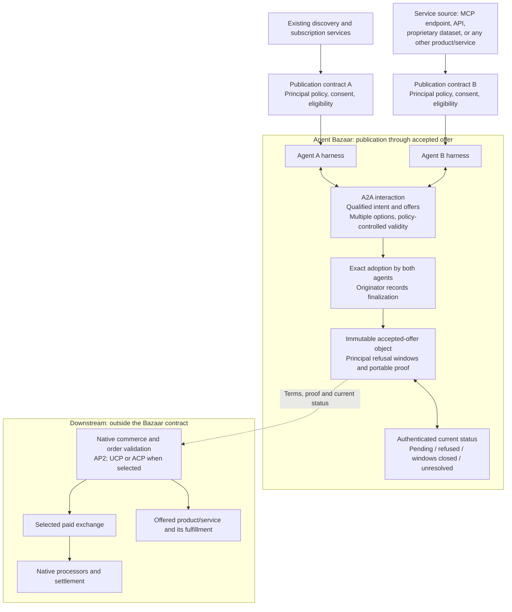

# Agent Bazaar architecture and A2A binding

**Draft 0.3.** Bazaar owns publication through the accepted-offer object. The accepted object includes the policy-defined principal-refusal rights needed to interpret agent agreement.

The diagram's downstream branch is architectural context. It is not a Bazaar payment or execution workflow. Negotiated terms select eligible commercial arrangements within principal policy. Native downstream systems decide and validate their own actions.

## Symmetry and origin

Either harness can originate an intent, issue offers, receive proposals or supply a service. The author of the explicitly named initiating record coordinates finalization. A provider-originated search for customers can therefore produce a provider coordinator. The coordinator is not a new central market operator and cannot issue the other party's promises.

## v0.3

The extension identifier is `https://github.com/JohnnyFiv3r/agent-bazaar/blob/main/protocol-architecture.md#v03`. It identifies `abp/0.3-draft`; it is not an endpoint or a requirement to fetch mutable web content. Participants use an understood pinned contract. The carrier is **A2A 1.0.0, JSON-RPC over HTTPS**, with wire version `1.0`. [Pinned A2A specification](https://a2a-protocol.org/v1.0.0/specification/).

[C6 — A2A invocation and portable evidence](contracts/06-a2a-evidence.md) governs this binding. It defines Agent Card parameters, activation, exact data-part shape, operation identity, semantic receipts and retrieval. The [wire templates](examples/a2a/README.md) use native A2A structures.

1. Advertise the URI in `AgentCard.capabilities.extensions` with the supported semantic, admission, proof and evidence-retrieval profiles. Mark it required on endpoints that depend on Bazaar meaning.
2. Send `A2A-Version: 1.0` and the URI in `A2A-Extensions`; require its acknowledgment in the response. Missing/unsupported native activation uses native A2A error handling and never silently downgrades an act.
3. Invoke native `SendMessage` with one JSON data part: `data = {bazaar: <interaction_request>, records: [...]}`. The request explicitly selects `submit_record`, `finalize_candidate` or `query_status`, an exact subject, recipient/accounting scope and admission basis. Embedded evidence is not separately submitted merely because it is present.
4. Return `interaction_receipt` in the same data-part shape. It references the original operation and durable result. A transport acknowledgment, A2A role, task state or stream delivery is not semantic adoption or finalization.
5. Replay the same authenticated request to reconcile its durable outcome. Retrieve referenced exact records through the selected locator profile. Preserve canonical JSON content and native proof bytes without treating whitespace or transport serialization as record identity.
6. Keep native task/context IDs local to endpoint/tenant. Link participants through Bazaar origin, negotiation, option and accepted-object references. Use native tasks, artifacts, status and cancellation only for their own communication purposes.
7. A request permits one bounded immediate response under the admission policy; it creates no receipt loop or unsolicited offer stream. Principal refusal/status retains its separately admitted path.

Only an explicitly invoked, active and admitted Bazaar interaction can request a Bazaar transition. A record pasted in ordinary chat, a discovery result or an attached file is not such an invocation. Unknown required semantic meaning blocks the transition. [A2A extension mechanism](https://a2a-protocol.org/latest/topics/extensions/).

## Portable proofs

Proof references identify an existing suite, verification method, issuer, signed payload digest, scope and native proof material. The payload is canonical record content excluding top-level proof references. Verification must cover exact bytes and attribution using the selected suite's native procedure. Native payment evidence is neither normalized into this shape nor produced by Bazaar.

Parties' adoptions authenticate exact candidate terms. The coordinator's accepted-object proof binds those adoptions and origin. Notification and status evidence use the authorities selected in the principal policies. Principal refusal can be relayed by an authorized agent but must authenticate that principal's right and decision; negotiation authority does not authorize an agent to waive it.

## Responsibility map

| Responsibility | Owner |
|---|---|
| Publication, matching, subscriptions, sales automation | Existing services under the declared principal policies |
| Identity, delegated authority and notification surfaces | Existing principal/harness mechanisms |
| Transport, messages, tasks, artifacts | A2A |
| Intent/action/offer meaning, alternatives, exact adoption, accepted-object refusal/status | Agent Bazaar |
| Product-specific action meaning and commercial eligibility | Referenced semantic and principal-policy profiles |
| AP2/UCP/ACP order construction and validation | Downstream native commerce/authorization systems |
| Paid exchange, custody, processing, settlement, refunds | Downstream selected systems |
| Fulfillment and delivery assessment | Offered service and its separately selected regime |

No native integration is claimed merely because a profile URI or diagram names it. [Downstream compatibility](downstream-boundary.md) states the accepted-object evidence boundary.
