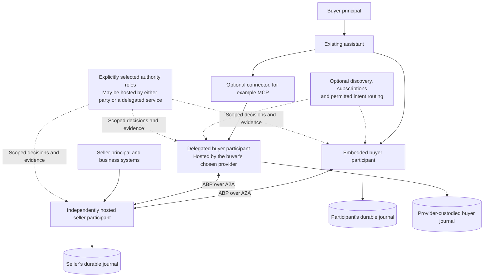

# Deployment, custody and scoped authority

**ABP 0.4-draft · deployment clarification · existing records and A2A binding**

ABP supports independently hosted participants. A seller exposes an A2A endpoint implementing the ABP extension. A buyer can use an embedded ABP participant or reach a delegated participant through one connector in an existing assistant. Optional discovery, intent routing and offer aggregation can sit around those participants. No Bazaar-operated service, mandatory discovery provider, network-wide registry or common database is part of the core agreement contract.

This document makes the ownership implications of [C1](contracts/01-publication-policy.md), [C3](contracts/03-admission-negotiation.md), [C4](contracts/04-formation.md), [C5](contracts/05-principal-refusal.md) and [C6](contracts/06-a2a-evidence.md) explicit. It introduces no semantic kind, RPC, product taxonomy or payment mechanism. The participant roles below illustrate deployment; buyer/seller labels do not limit the universal action model.

## Adoption and participant identity

The connector and embedded paths are alternatives. They produce the same C6 interactions. A connector can serve many counterparties; ABP does not require a different buyer connector for every seller. Compatibility, seller-specific authentication and admission still apply.

A connector is an application entry point. Its implementation arranges discovery, credentials and invocation of an actual ABP participant; calling a tool does not automatically grant commitment, disclosure, principal-refusal or native action authority. The principal's authenticated delegation determines those powers. A natural-language request or connector result is not a substitute for exact candidate adoption.

A hosted provider MUST preserve the identity of the principal represented by each act. In RP1, each enrolled agent identity has one principal binding. A provider representing several customers uses separate principal-bound identities and authorized routing/custody; its service identity does not silently stand in for all customers. Physical endpoint or database sharing grants no cross-principal access or authority. The current reference runtime is a trusted authority component, not a qualified shared-host tenant-isolation system.

The buyer participant needs an admitted inbound path for new offers/counteroffers and durable operation recovery. That path can be hosted by the chosen provider; the human need not run a server. C6 uses authenticated `SendMessage` interactions and semantic receipts. A chat, tool call, task/context ID or continuously open connection is not the lifetime of the agreement. Closing or replacing that session MUST NOT erase an outcome, restart a principal window or authorize a repeated effect.

A seller participant may be backed by deterministic quoting/inventory software, an LLM, a human-assisted process or a combination. Correct qualified acts and understood action semantics are the integration requirement. An intermediary cannot turn scraped descriptions into seller-authored promises.

## Who owns which state

A ledger here is durable protocol state: admitted operations, exact records, formation decisions, protected selections, refusal/status events and recoverable outcomes. Its custody and its authority are separate questions.

| State or decision | Responsible role | Limit of that role |
|---|---|---|
| Participant keys, policies and private operation journal | Participant or explicitly authorized custodian selected by its principal | Storing another issuer's record cannot issue, adopt, withdraw or reinterpret that issuer's promises |
| Consented publication, subscription delivery and matches | Chosen discovery/routing service under C1 | A match grants neither reply permission nor authority over private negotiations |
| Admission, replay and contact budgets | Recipient's designated accounting authority, identified in its admission policy | Scope follows the declared recipient/allowance; an unrelated tenant's offers do not consume it unless the owners explicitly selected that shared scope |
| Candidate coordination and accepted-object authorship | Authenticated author of the selected initiating record | Relay position, hosting or buyer-side aggregation does not replace the originator |
| Capacity and conflicting selections | Authority selected by the owner of the affected resource | Its declared scope covers all competing allocations of that resource across coordinators/carriers; it is not a network-wide market authority |
| Refusal admission, current status and closure | Authority selected in the adopted status/refusal policies | Copies elsewhere cannot infer closure from missing refusals, elapsed local time or an unavailable authority |
| Native order, payment, performance and settlement state | Selected downstream systems | ABP records and clearance do not supply native authorization or prove an external outcome |

Each participant MAY retain its own permitted signed records and receipts in a separate durable store, or delegate that custody. Authorized participants MUST be able to recover the exact evidence and outcomes required by their selected profile. A custodian MUST enforce disclosure and retention rules; possession of a record or locator does not grant permission to serve it to another customer, broker or auditor.

A received copy is evidence. It is not a new authoritative writer for the fact it describes. The relevant record/policy references already bind principal delegation, recipient accounting, resource selection, coordination and refusal/status roles. There is no universal `ledger_owner` field that overrides those roles.

## Intent distribution and buyer-side aggregation

One permitted intent can reach several eligible counterparties through direct delivery, a directory or subscriptions. Each delivery MUST satisfy its publication subject, representation, audience, use and onward-disclosure rules. Routing preserves the original qualified emission and attribution. A permitted derivative has its own attribution and scope; it is not the unchanged signed original.

An intent does not become an offer to buy or supply the desired outcome merely because a service distributes it. A subscription, discovery match or connector installation does not grant unbounded reply permission. Each offer/counteroffer uses the recipient's separately admitted C3/C6 path, option lineage and finite budgets. New carrier IDs, sender aliases or routing services do not reset an allowance that applies to the same declared scope. Each seller remains the issuer of its own qualified promises.

A buyer-side service can collect, compare and negotiate offers when delegated to do so. The final candidate preserves the exact selected revisions; comparison or ranking cannot splice their terms. The selected origin still determines coordination. If the hosted buyer participant authors the initiating intent for its principal, it coordinates that agreement. If the service only relays another participant's intent, it does not acquire that role.

Private preferences, willingness-to-pay ceilings and unrelated customer information stay with their permitted custodians unless disclosure is authorized and required. The parties exchange understood exchange-scoped policies and authority evidence sufficient for the agreed checks. A digest or unverified summary cannot hide a material condition while claiming it was checked; if required meaning/authority cannot be shared or established by the selected mechanism, automatic adoption remains blocked. ABP does not supply a general private-computation or redaction mechanism.

Discovery, indexing, matching, subscription operation, ranking, offer comparison, commercial UX, accounts and the MCP-facing product surface belong to applications. A provider such as Keenable can implement those roles without becoming mandatory for other participants. No such product is implemented by this protocol clarification.

## Authority compatibility and recovery

Independent hosting does not require independent writers for the same conflict scope. Participants MUST select and understand the applicable authority arrangement before adoption. Under C4, separate formation/resource authorities require a selected profile that establishes an equivalent recoverable finalization decision. Two local success responses, copying a database or exchanging signatures without that mechanism do not establish atomic allocation or a unique formation outcome.

Each accepted object has the adopted logical refusal-admission order and status authority. Its implementation may have separate ingress services or replicas only when their ordering, recovery, timeliness and completeness satisfy the selected profile. A buyer's local queued refusal is not a claim that the authority received it. Conversely, communication failure, an uncredited interval or a pending potentially timely authority admission MUST NOT be converted into principal clearance. Gate decisions use authenticated current authority evidence under the adopted freshness rules and preserve known newer refusals/conflicts.

Lost replies are recovered using the original scoped operation and exact candidate/accepted references. Neither party frees protected capacity or creates another native effect because its local response is missing. Changing a host or authority requires the selected profile's explicit continuity, authorization and fencing mechanism; copying keys/records or changing an Agent Card alone does not transfer authoritative control over an existing agreement.

AP2 and other native authorization contracts remain optional downstream integration choices. Competing offers are ABP records; the core defines no offer-registration call to a payment system. C8, when enabled, gates the selected native action on applicable principal clearance, dependencies and separate native authority. Human checkout and autonomous checkout are application/native paths that must preserve those boundaries; neither silently substitutes different commercial terms.

## Core, RP1 and implementation coverage

| Claim | Current status |
|---|---|
| Embedded or connector-accessed buyer, independently hosted sellers, optional discovery/aggregation | Supported core deployment model using existing C1–C6 records and A2A binding |
| Separate participant custody and verification of exact signed records | Permitted by core; portable-record tests exercise distinct keys, public-only peer registries and separate stores |
| A shared conflict authority chosen by the affected owners | RP1's concrete preset; one fenced writer per scope, no global Bazaar operator |
| Complete reference-runtime negotiation/recovery across independent participant stores | Not implemented by runtime 0.1; its formation/recovery checks read one shared authority store |
| Separate authoritative conflict domains jointly finalizing a formation | Requires a further concrete profile/mechanism and qualification; RP1 explicitly blocks incompatible authorities |
| Hosted multi-customer isolation, external builder adoption, independent implementation interoperability | Not established by the reference simulation or portability tests |

RP1 retains its explicit common-conflict-authority and same-scope requirements. Participants with separate keys, endpoints and evidence stores can choose that authority without transferring every journal to it or using the same host, but the distributed bindings must be implemented and qualified. The current Python harness does not yet supply those remote authority/admission/status bindings. Its successful mTLS finalization test starts with shared local semantic state; it is not evidence of separately operated buyer/seller formation.

The [next independent-participant slice](design/independent-participant-slice.md) defines the remaining protocol-runtime work and its acceptance checks. It contains no discovery, shopping-product or payment implementation requirement. [Runtime documentation](docs/runtime.md) and [validation](validation.md) identify what has actually run.
