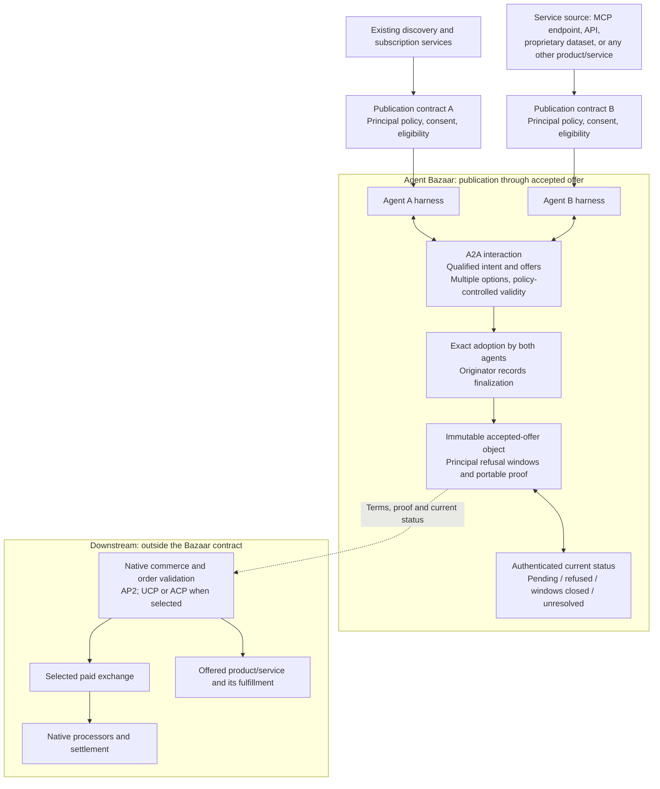

# Agent Bazaar architecture and A2A binding

**Draft 0.2.** Bazaar owns publication through the accepted-offer object. The accepted object includes the policy-defined principal-refusal rights needed to interpret agent agreement.

The diagram's downstream branch is architectural context. It is not a Bazaar payment or execution workflow. Negotiated terms select eligible commercial arrangements within principal policy. Native downstream systems decide and validate their own actions.

## Symmetry and origin

Either harness can originate an intent, issue offers, receive proposals or supply a service. The author of the explicitly named initiating record coordinates finalization. A provider-originated search for customers can therefore produce a provider coordinator. The coordinator is not a new central market operator and cannot issue the other party's promises.

## A2A extension

The carrier remains A2A 1.0.0 with wire version `1.0`; Bazaar's semantic profile is independently versioned as `abp/0.2-draft`. Documentation uses `https://example.org/extensions/agent-bazaar/v0.2` until a publication URI is selected. [A2A specification](https://a2a-protocol.org/v1.0.0/specification/), [extension mechanism](https://a2a-protocol.org/latest/topics/extensions/).

1. Advertise the extension URI and supported semantic/admission/proof profiles in `AgentCard.capabilities.extensions`. Mark it required on endpoints that depend on Bazaar meaning.
2. Activate through native extension negotiation and require acknowledgment before applying dependent transitions. Unsupported required semantics are rejected.
3. Carry typed records in native message data parts and retain content references under extension metadata. Use native A2A artifacts or an authenticated durable repository for retrievable exact evidence.
4. Keep task/context IDs local to their native endpoint/tenant. Link participants through Bazaar origin, negotiation, option and accepted-object references. A message role does not assign market role or promise polarity.
5. Preserve authenticated issuer and portable proof. A relay cannot become author, and a transport acknowledgment cannot become adoption.
6. Use native task/status/cancellation operations where needed for communication. Task completion, cancellation and stream delivery do not determine commercial acceptance or principal refusal.

## Portable proofs

Proof references identify an existing suite, verification method, issuer, signed payload digest, scope and native proof material. The payload is canonical record content excluding top-level proof references. Verification must cover exact bytes and attribution using the selected suite's native procedure. Native payment evidence is neither normalized into this shape nor produced by Bazaar.

Parties' adoptions authenticate exact candidate terms. The coordinator's accepted-object proof binds those adoptions and origin. Notification and status evidence use the authorities selected in the principal policies. Principal refusal can be relayed by an authorized agent but must authenticate that principal's right and decision; negotiation authority does not authorize an agent to waive it.

## Responsibility map

| Responsibility | Owner |
|---|---|
| Publication, matching, subscriptions, sales automation | Existing services under the declared principal policies |
| Identity, delegated authority and notification surfaces | Existing principal/harness mechanisms |
| Transport, messages, tasks, artifacts | A2A |
| Intent/action/offer meaning, alternatives, exact adoption, accepted-object refusal/status | Agent Bazaar |
| Product-specific action meaning and commercial eligibility | Referenced semantic and principal-policy profiles |
| AP2/UCP/ACP order construction and validation | Downstream native commerce/authorization systems |
| Paid exchange, custody, processing, settlement, refunds | Downstream selected systems |
| Fulfillment and delivery assessment | Offered service and its separately selected regime |

No native integration is claimed merely because a profile URI or diagram names it. [Downstream compatibility](downstream-boundary.md) states the accepted-object evidence boundary.
