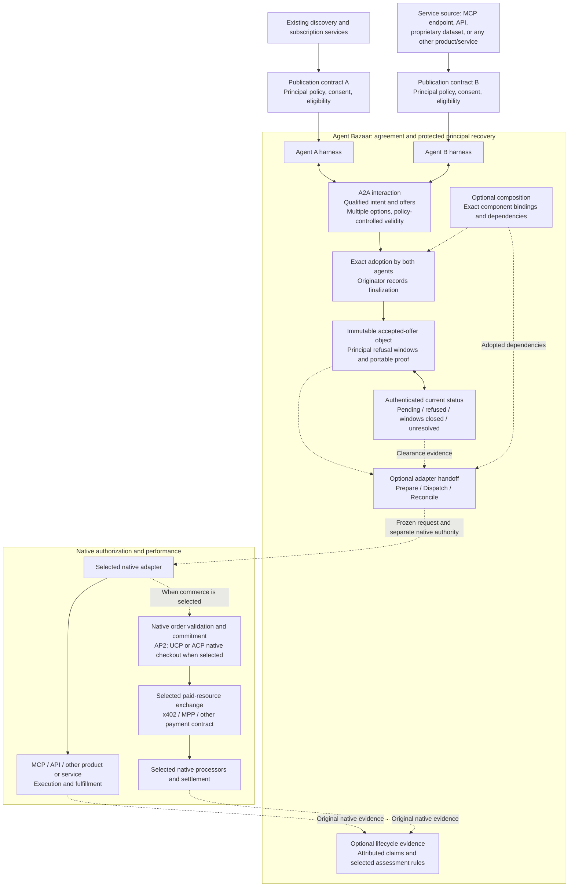

# Agent Bazaar architecture and A2A binding

**Draft 0.4.** The default Bazaar path forms one exact bilateral agreement and preserves each principal's protected refusal period. Optional features compose those agreements and govern the boundary to native actions and their evidence. Native execution, payment and settlement remain with the selected systems.

The optional branches are not prerequisites for a bilateral agreement. A2A carries Bazaar interactions; MCP exposes tool capabilities; native authorization and payment contracts retain their own rules. Naming a framework does not implement an adapter. Bazaar distinguishes agreement, principal clearance, downstream permission and attributable outcome evidence; none substitutes for another.

[RP1](profiles/reference-profile.md) fixes the default mechanisms in an authenticated realm manifest and assigns protocol mechanics to the [reference harness design](profiles/harness-interface.md). Applications supply truthful capability, principal permission, real constraints and notice integration; native adapters are needed only for the corresponding optional feature. No SDK or runtime is implemented by this architecture, and [boundary tests](tests/PROPOSED.md) are proposed, not passed.

## Symmetry and origin

Either harness can originate an intent, issue offers, receive proposals or supply a service. The author of the explicitly named initiating record coordinates finalization. A provider-originated search for customers can therefore produce a provider coordinator. The coordinator is not a new central market operator and cannot issue the other party's promises.

## v0.4

The extension identifier is `https://github.com/JohnnyFiv3r/agent-bazaar/blob/main/protocol-architecture.md#v04`. It identifies `abp/0.4-draft`; it is not an endpoint or a requirement to fetch mutable web content. Participants use an understood pinned contract. The carrier is **A2A 1.0.0, JSON-RPC over HTTPS**, with wire version `1.0`. [Pinned A2A specification](https://a2a-protocol.org/v1.0.0/specification/).

[C6 — A2A invocation and portable evidence](contracts/06-a2a-evidence.md) governs this binding. It defines Agent Card parameters, activation, exact data-part shape, operation identity, semantic receipts and retrieval. The [wire templates](examples/a2a/README.md) use native A2A structures.

1. Advertise the URI in `AgentCard.capabilities.extensions` with semantic, admission, proof and retrieval profiles plus `supported_features`. `bilateral` is the baseline; `composition`, `adapter-handoff` and `lifecycle-evidence` are optional. A selected reference profile uses the paired `referenceProfileUri`/`profileManifestRef`; RP1 requires both. Mark the A2A extension required on endpoints that depend on Bazaar meaning.
2. Send `A2A-Version: 1.0` and the URI in `A2A-Extensions`; require its acknowledgment in the response. Missing/unsupported native activation uses native A2A error handling and never silently downgrades an act.
3. Invoke native `SendMessage` with one JSON data part: `data = {bazaar: <interaction_request>, records: [...]}`. Baseline purposes are `submit_record`, `finalize_candidate` and `query_status`. Enabled adapter handoff adds `prepare_handoff`, `dispatch_handoff` and `reconcile_handoff`, each naming the same exact `handoff_request`. Each request binds its subject, recipient/accounting scope and admission basis. Embedded evidence is not separately submitted merely because it is present.
4. Return `interaction_receipt` in the same data-part shape. It references the original operation and durable result. A transport acknowledgment, A2A role, task state or stream delivery is not semantic adoption or finalization.
5. Replay the same authenticated request to reconcile its durable outcome. Retrieve referenced exact records through the selected locator profile. Preserve canonical JSON content and native proof bytes without treating whitespace or transport serialization as record identity.
6. Keep native task/context IDs local to endpoint/tenant. Link participants through Bazaar origin, negotiation, option and accepted-object references. Use native tasks, artifacts, status and cancellation only for their own communication purposes.
7. A request permits one bounded immediate response under the admission policy; it creates no receipt loop or unsolicited offer stream. Clarification consumes negotiation traffic; genuine refusal/status/replay/withdrawal controls retain separately admitted paths.
8. Every signed semantic record and interaction declares `required_features`, including `bilateral`. Check those requirements together with features implied by its kind, fields and resolved subject against the verified support of all required participants before the dependent transition. Advertisement is not authorization; an omitted feature cannot hide an advanced requirement.

Only an explicitly invoked, active and admitted Bazaar interaction can request a Bazaar transition. A record pasted in ordinary chat, a discovery result or an attached file is not such an invocation. Unknown required semantic meaning blocks the transition. [A2A extension mechanism](https://a2a-protocol.org/latest/topics/extensions/).

## Portable proofs

Proof references identify an existing suite, verification method, issuer, signed payload digest, scope and native proof material. The signed payload is canonical record content excluding top-level `proofs`; a full content reference includes those proof references. RP1 selects JCS/SHA-256 and JWS Ed25519. Verification covers exact bytes, scope and attribution under the selected mechanism, separately from authority.

Common content references hash complete canonical JSON objects. An opaque native request, proof or evidence object uses a profile-defined immutable JSON wrapper preserving its original bytes and encoding. Its outer JCS digest differs from a native payload digest or signature inside it. This preserves native evidence without treating it as a Bazaar mandate or reserializing the bytes its native verifier checks.

Parties' adoptions authenticate exact candidate terms. The coordinator's accepted-object proof binds those adoptions and origin. Notification and status evidence use the authorities selected in the principal policies. Principal refusal can be relayed by an authorized agent but must authenticate that principal's right and decision; negotiation authority does not authorize an agent to waive it.

## Responsibility map

| Responsibility | Owner |
|---|---|
| Publication, matching, subscriptions, sales automation | Existing services under the declared principal policies |
| Identity, delegated authority and notification surfaces | Existing principal/harness mechanisms |
| Transport, messages, tasks, artifacts | A2A |
| Intent/action/offer meaning, alternatives, exact adoption, accepted-object refusal/status | Agent Bazaar |
| Optional composition, exact handoff eligibility and lifecycle-evidence interpretation | Agent Bazaar C7/C8, with explicitly negotiated features |
| Product-specific action meaning and commercial eligibility | Referenced semantic and principal-policy profiles |
| Native tool requests, AP2 mandates and other native order/payment contracts | Selected native adapters and their systems |
| Paid exchange, custody, processing, settlement, refunds | Downstream selected systems |
| Fulfillment and delivery assessment | Offered service and its separately selected regime |

No native integration is claimed merely because a profile URI or diagram names it. [Downstream compatibility](downstream-boundary.md) describes how the agreement, guarded handoff and original evidence relate to native systems.
